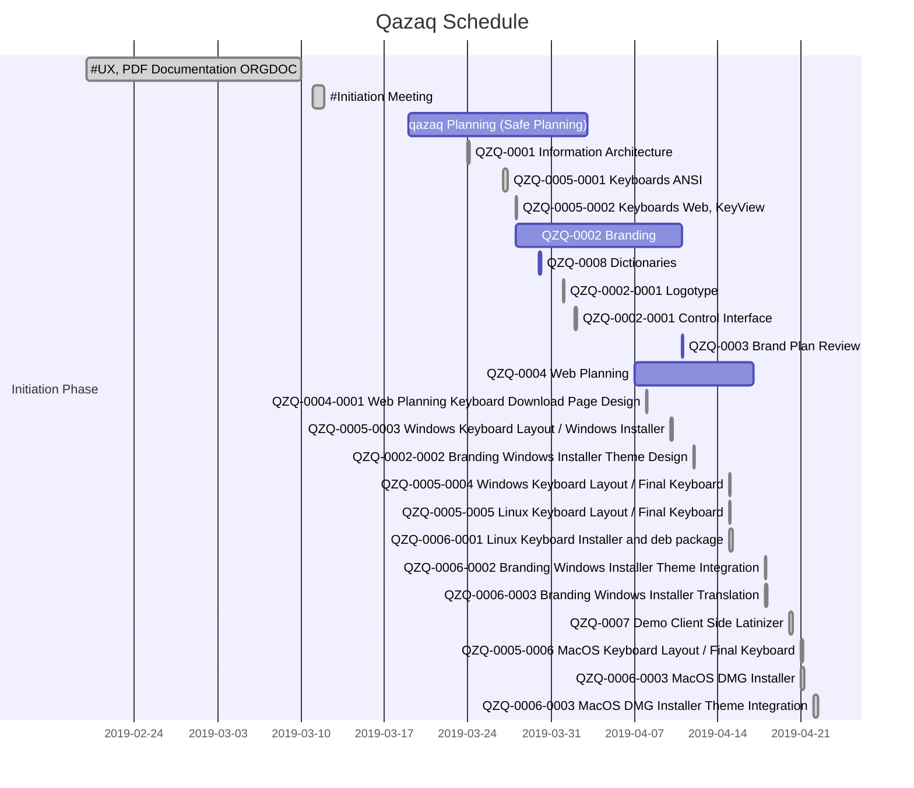

## **Preface**

**Qazaq.org** is a project of **VivaRado**, it serves as a foundation for the actions of the company in terms of culture, language and arts for the Republic of Kazakhstan.


### **Contents**

1.  **Introduction**
    1.  **Profile**
    1.  **Project Overview**
        1.  **Background**
        1.  **Need**
        1.  **Scope**
        1.  **Activities**
    1.  **Organisational Documents**
    1.  **Phase Introduction**
        1.  **Phase Levels**
        1.  **Initiation Phase**
            1.  **Business Case**
                1.  **Solution Options**
            1.  **Project Charter**
                1.  **Project Introduction**
                    1.  **Project Statements**
                1.  **Project Goals**
                1.  **Project Structure**
                1.  **Deliverables**
                1.  **Duration**
        1.  **Planning Phase**
            1.  **Safe Planning**
                1.  **Project Plan**
                    1.  **Website Portal**
                        1.  **Page Hierarchy**
                        1.  **Website Content**
                    1.  **Keyboards**
                        1.  **Qazaq Basic**
                        1.  **Qazaq International**
                        1.  **Install**
                            1.  **Linux**
                            1.  **Windows**
                            1.  **MacOS**
                        1.  **Build**
                            1.  **Linux**
                            1.  **Windows**
                            1.  **MacOS**
                        1.  **Printing**
                            1.  **ANSI**
                            1.  **Web**
                    1.  **Dictionaries**
                1.  **Work Planning**
                    1.  **Task Assignments**
                    1.  **Dependencies**
                1.  **Resource Requirements**
                    1.  **Scope of Requirements**
                    1.  **Production Strategy**
                1.  **Schedule Planning**
                1.  **Budget Planning**
            1.  **Stakeholders**
                1.  **Personnel Plan**
                1.  **Communication Plan**
            1.  **Quality Plan**
        1.  **Implementation Phase**
            1. **Communication**
            1. **Solutions**

### Glossary

1.  **Glossary**

### Reference

1.  **Reference**


### **Introduction / Phase Introduction / Implementation Phase**

---

### **Introduction / Phase Introduction / Implementation Phase / Solutions**

*  Researched Solutions:

	*  Qazaq.org


---

##  **Introduction**

**VivaRado** is a technology company, focusing on creating unique products and services from the ground up.
Our system architecture standards and software, design and branding services allow us to create unique content and experiences.

### **Introduction / Profile**

*   Company: VivaRado LLP

---


### **Introduction / Project Overview**

*  Project Overview
	*  background
	*  need
	*  scope
	*  activities
	*  important dates or deadlines

*   Project Name: qazaq.org
*   Proposal Date: 20/02/2019

---

### **Introduction / Project Overview / Background**

On April 12, 2017, President Nazarbayev published an article in state newspaper Egemen Qazaqstan announcing a switchover to the Latin alphabet by 2025, a decision implemented by decree. Nazarbayev argued that "Kazakh language and culture have been devastated" during the period of Soviet rule, and that ending the use of Cyrillic is useful in re-asserting national identity. The new Latin alphabet is also a step to weaken the traditional Russian influence on the country, as the Russian language is the country's second official language. The initial proposed Latin alphabet tried to avoid digraphs (such as "sh", "ch") and diacritics (such as "ä" or "ç"). In fact, President Nazarbayev had expressly stated that the new alphabet should contain "no hooks or superfluous dots". Instead, the new alphabet, which is based on a transliteration of Cyrillic into Latin letters, would have used apostrophes to denote those Kazakh letters where there was no direct Latin equivalent.

[wiki source](https://en.wikipedia.org/wiki/Kazakh_alphabets)

---

### **Introduction / Project Overview / Need**

There is a need for integration of the Qazaq alphabet to fonts.

---

### **Introduction / Project Overview / Scope**

Given the efforts of the Kazakh government in terms of latinisation, a need arises for the creation of fonts that integrate the new alphabet so it can be used easier, leveraging easier integration. This allong with existing technology gave rise to the idea of Qazaq.org, a portal that will initially provide access to typographic elements, and later expand to more sectors to be identified in the future.

---

### **Introduction / Project Overview / Activities**

Currently identified activites:

*  Present the first phase of documentation (this).
*  Create and present the Initiation and Planning for the project.
*  Identify the project tracks that will produce the deliverables.
*  Identify the dependiencies.

---


The documentation for this project and the project modules has been split to partial MD files for easier editing and alterations. Three options are provided (HTML,PDF,MD) Contents of generated files are stored in the ``` /README ``` folder as numbered main files and includes in the ``` /README/partials ``` as partial MD files.

Documentation Types and generating them:

*  HTML - Responsive preview in HTML format - At README directory:

	```python3 README/gen_readme.py -f 'html'```

*  Standard Repository README - At the root of the repository:
	
	```python3 README/gen_readme.py -f 'md'```

*  PDF - At the root of the repository:
	
	```python3 README/gen_readme.py -f 'pdf'```

You can pass multiple formats:

```python3 README/gen_readme.py -f 'html,pdf,md'```

Requirements:

*  Markdown2 module for python3
	
	*  Linux: ```pip3 install markdown2```
	*  Windows: ```py -m pip install markdown2```

*  pygments

	*  Linux: ```pip3 install pygments```
	*  Windows: ```py -m pip install pygments```

*  weasyprint

	*  Linux: ```pip3 install weasyprint```
	*  Windows: ```py -m pip install weasyprint```


Features:

*  Responsive Interface
*  Synchronized Sidebar
*  Hashtag Navigation
*  PDF with TOC and Cover

Drawbacks:

*  Graphs and Diagrams will not work in github and bitbucket preview, but are still readable.
*  Graphs and Diagrams will not work in PDF will be assessed.

Details:

*  For the PDF Contents. As we generate URL style blocks:
	*  We override the weasyprint Document.make_bookmark_tree

*  For the HTML and the Diagrams. As we load them into Codeblocks:
	*  We override the markdown2 Markdown._code_block_sub
	*  We override the markdown2 Markdown._color_with_pygments


---

### **Introduction / Phase Introduction**

**Initiation Phase**:

The research of the benefits that lead us to the decision, the factors of success and the announcement of the project.

---

**Planning Phase**:

Used to identify the work to be done, the schedule and budget, the risks and stakeholders, and the quality expectations.

---

**Implementation Phase**:

The work begins by setting and maintaining the planned course, communicating the plan and changes, and monitoring the quality of the work and deliverables.

---


### **Introduction / Phase Introduction / Phase Levels**

#### Level 1:

*  **Minimum Project Management Plan Level 0** Components ∞0.001:

    1.  **Profile**
    1.  **Organisational Documents**
    1.  **Project Overview**
        1.  **Background**
        1.  **Need**
    1.  **Phase Introduction**
        1.  **Phase Levels**
        1.  **Initiation Phase**
            1.  **Business Case**
                1.  **Solution Options**
                1.  **Strategic case**
                1.  **Financial case**
                1.  **Management case**
                1.  **Evaluation**
            1.  **Project Charter**
                1.  **Project Introduction**
                    1.  **Project Statements**
                1.  **Project Goals**
                1.  **Project Structure**
                1.  **Deliverables**
                1.  **Duration**
        1.  **Planning Phase**
            1.  **Safe Planning**
                1.  **Work Planning**
                    1.  **Project Plan**
                        1.  **Task Assignments**
                        1.  **Dependencies**
                    1.  **Resource Requirements**
                        1.  **Scope of Requirements**
                        1.  **Production Strategy**
                1.  **Schedule Planning**
                1.  **Budget Planning**
            1.  **Stakeholders**
                1.  **Personnel Plan**
                1.  **Communication Plan**
            1.  **Quality Plan**
                1.  **Quality Targets**
                1.  **Quality Management**


---


### **Introduction / Phase Introduction / Initiation Phase**

The important elements of the Intiation Phase is the **Business Case**, followed by a **Feasibility Study** and a **Project Charter**.

**Business Case**:

As VivaRado is affiliated with the segment of linguistics and internationalisation through typography and fonts, we decided to offer a set of initial resources for the smooth transition to the new Qazaq language. We have researched and present a keyboard along with a web portal to offer additional resources, added as the project progresses and they are suggested or otherwise identified.

---

**Project Charter**:

What are the deliverables and the authorisation to do the project. It encapsulates the announcement to do the project.

---


*  **Initiation Phase** Components ∞0.001:
	
	1.  **Business Case**:
		*  Strategic case
		*  Commercial case
		*  Management case

	1.  **Project Charter**:
		*  Project Introduction
		*  Project Goal(s)
		*  Project Structure
		*  Deliverables
		*  Duration


---

### **Introduction / Phase Introduction / Initiation Phase / Business Case**

A business case captures the reasoning for initiating a project or task.

The purpose of a business case is to weigh up the costs and benefits of a suggested course of action and thereby present the argument for a new way of delivering services. Might not be required and one could proceed directly to the Business Planning Phase.

---

Requirements:

*  Establish a clear need for intervention - a case for change.
*  Set clear objectives - what you want to achieve from the investment.
*  Consider a wide range of potential solutions - ensuring an optimal balance of benefits, cost and risk.
*  Put the arrangements in place to successfully deliver the proposal.

---

*  **Business Case** Components ∞0.003:
	1.  **Solution Options**
	1.  **Strategic case**
		*  Objectives
		*  Analysis
		*  Strategic Contributions
        *  Strategic Risks
        *  Success Factors
	1.  **Financial case**
		*  Affordability
	1.  **Management case**
		*  Achievability
		*  Achievements Plan
	1.  **Evaluation**


---

### **Introduction / Phase Introduction / Initiation Phase / Business Case / Solution Options**

Identified Solution Options:
	
*  Provide Keyboard Layouts for major operating systems with installers.
*  Offer a portal with an initial offering of the keyboards.

---

### **Introduction / Phase Introduction / Initiation Phase / Project Charter**


*  **Project Charter** Components ∞0.002:
	*  Project Introduction
	*  Project Goals
	*  Project Structure
	*  Business Solution
	*  Deliverables
	*  Duration
	*  Benefits and Limitations

---

### **Introduction / Phase Introduction / Initiation Phase / Project Charter / Project Introduction**

*  **Project Introduction** Components ∞0.002:

	*  Project Name
	*  Project Statements
		*  Vision Statement
		*  Mission Statement
	*  Project Definition
		*  Problem 
		*  Opportunity

---

### **Introduction / Phase Introduction / Initiation Phase / Project Charter / Project Introduction / Project Statements**

####  Vision Statement:
	
Delivering an input power for the Qazaq langauge users


---

### **Introduction / Phase Introduction / Initiation Phase / Project Charter / Deliverables**

*  **Deliverables** Components ∞0.001:
	*  Functions and Features
	
---

### **Introduction / Phase Introduction / Initiation Phase / Project Charter / Project Goals**

Identified Goals:

*  Delivery Usable keyboards for popular operating systems.

---

### **Introduction / Phase Introduction / Initiation Phase / Project Charter / Project Structure**

*  **Project Structure** Components ∞0.001:
	*  Project Scope
	*  Project Team

---

#### Project Scope:

We have divided the project into the **Product Main** that is the **Qazaq.org** portal, and **Product Modules**. Each of those parts has its own set of development and design requirements. 


#### Project Team:

The initial team that will provide the deliverables:

*  Andreas Kalpakidis
*  Madina Akhmatova

---

### **Introduction / Phase Introduction / Planning Phase**

The Planning Phase, is where the project solution is further developed in as much detail as possible and the steps necessary to meet the project’s objectives.

The Planning Phase consists of:

1.  **Safe Planning**
1.  **Stakeholders**

At this point, the project would have been planned in detail and is ready to be executed.

---

### **Introduction / Phase Introduction / Planning Phase / Safe Planning**

The project's **Project Plan** is created outlining the activities, tasks, dependencies, and timeframes. 


*  **Safe Planning** Components (Scope Management): 

	*  Project Plan:
		*  Activities
		*  Tasks
		*  Timeframes
	*  Work Planning:
		*  Dependencies
	*  Schedule Planning.

---

### **Introduction / Phase Introduction / Planning Phase / Safe Planning / Project Plan**

*  Identified Project Parts:
	*  Website Portal
		*  Design
			*  Branding
			*  Wireframes
			*  Page Renders
		*  Development
			*  Client Side
			*  Server Side
	*  Website Content
		*  Linux Keyboard Installer
		*  MacOS Keyboard Installer
		*  Windows Keyboard Installer
		*  Keyboard alterations overview (Keyview)

---

### **Introduction / Phase Introduction / Planning Phase / Safe Planning / Project Plan / Website Portal**

For the website we will implement our existing frameworks.

*  Website Portal
	*  Design
		*  Branding
		*  Wireframes
		*  Page Renders
	*  Development
		*  Client Side
		*  Server Side
	*  Website Content
		*  Language Keyboard Installers


---

### **Introduction / Phase Introduction / Planning Phase / Safe Planning / Project Plan / Website Portal / Design**

#### Branding

The Qazaq.org Logotype:


For the complete branding guide ∞05: ```README/README/assets/media/qazaq_brand_05.pdf```

---

### **Introduction / Phase Introduction / Planning Phase / Safe Planning / Project Plan / Website Portal / Page Hierarchy**

*  **Page Hierarchy** Components ∞0.001:
	1.  Homepage
		*  Layout:
			*  Regular Fullpage, title and text
	1.  About
		*  Layout:
			*  Regular Fullpage, Intro
			*  Thumbnails Fullpage, What we offer
			*  Thumbnails Fullpage, Our affiliation or endorsements.
	1.  Fonts
		*  Layout:
			*  Regular Fullpage, font preview marketing
			*  Inner Page:
				*  Fullpage detailed font preview
				*  Fullpage interactive substitution preview
	1.  Keyboards
		*  Layout:
			*  Software Download, e.g. Like Firefox or Chrome download
			*  Keyview

---

### **Introduction / Phase Introduction / Planning Phase / Safe Planning / Project Plan / Website Portal / Website Content**

*  **Website Content** Components ∞0.001:
	1.  Fonts
		1.  Substitutions
			1.  Latin to Qazaq
			1.  Russian to Qazaq
			1.  Kazakh to Qazaq
	1.  Keyboards
		1.  Available Keyboards
			1.  Linux Keyboard
			1.  Windows Keyboard
			1.  MacOS Keyboard
			1.  Android Keyboard
		1.  Preview Keyboards
			1.  lib/keycode_client
		1.  Overview Keyboards
			1.  lib/keyview_client

---

### **Introduction / Phase Introduction / Planning Phase / Safe Planning / Project Plan / Keyboards**

1.  Keyboards
	1.  Linux Keyboard
	1.  Windows Keyboard
	1.  MacOS Keyboard
	1.  Android Keyboard

1.  Available Keyboards:
	1.  Kazakh (Qazaq basic)
	1.  Kazakh (Qazaq intl.)

---

### **Introduction / Phase Introduction / Planning Phase / Safe Planning / Project Plan / Keyboards / Qazaq Basic**

According to Decree 569 (26 October 2017); Amended by Decree 637 (19 February 2018)


```
Kazakh Qazaq Basic ∞0.001

Based on English (US, basic, with dead keys)

┌─────┐
│ 2 4 │   2 = Shift,  4 = AltGr + Shift
│ 1 3 │   1 = Normal, 3 = AltGr
└─────┘

Ansi 0
┌─────┬─────┬─────┬─────┬─────┬─────┬─────┬─────┬─────┬─────┬─────┬─────┬─────┲━━━━━━━━━━━┓
│ ~   │ !   │ @   │ #   │ $   │ %   │ ^   │ &   │ *   │ (   │ )   │ _   │ +   ┃ ⌫         ┃
│ `   │ 1   │ 2   │ 3   │ 4   │ 5 € │ 6   │ 7   │ 8   │ 9   │ 0   │ - ¥ │ =   ┃ Bksp      ┃
┢━━━━━┷━━┱──┴──┬──┴──┬──┴──┬──┴──┬──┴──┬──┴──┬──┴──┬──┴──┬──┴──┬──┴──┬──┴──┬──┺━━┯━━━━━━━━┩
┃        ┃ Q   │ W   │ E   │ R   │ T   │ Y Ý │ U Ú │ I İ │ O Ó │ P   │ {   │ }   │ |      │
┃Tab ↹   ┃ q   │ w   │ e   │ r   │ t ₸ │ y ý │ u ú │ i ı │ o ó │ p   │ [   │ ]   │ \      │
┣━━━━━━━━┻┱────┴┬────┴┬────┴┬────┴┬────┴┬────┴┬────┴┬────┴┬────┴┬────┴┬────┴┲━━━━┷━━━━━━━━┪
┃         ┃ A Á │ S Ś │ D   │ F   │ G Ǵ │ H   │ J   │ K   │ L   │ :   │ "   ┃ Enter       ┃
┃Caps ⇬   ┃ a á │ s ś │ d   │ f   │ g ǵ │ h   │ j   │ k   │ l   │ ;   │ '   ┃ ⏎           ┃
┣━━━━━━━━━┻━━━┱─┴───┬─┴───┬─┴───┬─┴───┬─┴───┬─┴───┬─┴───┬─┴───┬─┴───┬─┴───┲━┻━━━━━━━━━━━━━┫
┃             ┃ Z   │ X   │ C Ć │ V   │ B   │ N Ń │ M   │    │ ?   ┃               ┃
┃Shift ⇧      ┃ z   │ x   │ c ć │ v   │ b   │ n ń │ m   │ ,   │ .   │ / № ┃Shift ⇧        ┃
┣━━━━━━━┳━━━━━┻┳━━━━┷━┱───┴─────┴─────┴─────┴─────┴─────┴─┲━━━┷━━┳━━┷━━━┳━┻━━━━━┳━━━━━━━━━┫
┃       ┃      ┃      ┃ ␣                               ⍽ ┃    ⇮ ┃      ┃       ┃         ┃
┃Ctrl   ┃Meta  ┃Alt   ┃ ␣           Space               ⍽ ┃AltGr ┃Meta  ┃Menu   ┃Ctrl     ┃
┗━━━━━━━┻━━━━━━┻━━━━━━┹───────────────────────────────────┺━━━━━━┻━━━━━━┻━━━━━━━┻━━━━━━━━━┛

┌────────┐
│        │ + A = Á (same for Yacute, Uacute, Iacute, Oacute, Sacute, Cacute, Nacute)
│ AltGr ⇮│ (AltGr and A)
└────────┘

```
Please view local HTML for accuracy.

---

### **Introduction / Phase Introduction / Planning Phase / Safe Planning / Project Plan / Keyboards / Qazaq International**

According to Decree 569 (26 October 2017); Amended by Decree 637 (19 February 2018)

This is a more advanced and currently not implemented keyboard. We do plan to present this solution in the near future depending on the reception of the basic keyboard.

```
Kazakh Qazaq International ∞0.001

Based on English (US, intl., with dead keys)

┌─────┐
│ 2 4 │   2 = Shift,  4 = AltGr + Shift
│ 1 3 │   1 = Normal, 3 = AltGr
└─────┘

Ansi 0
┌─────┬─────┬─────┬─────┬─────┬─────┬─────┬─────┬─────┬─────┬─────┬─────┬─────┲━━━━━━━━━━━┓
│ ~   │ ! ¹ │ @ ̋◌ │ # ̄◌ │ $ £ │ % ̧◌ │ ̂◌ ^ │ & ̛ │ * ̧  │ ( ̆◌ │ ) ̊◌ │ _ ̣◌ │ + ÷ ┃ ⌫         ┃
│ ` ´ │ 1 ¡ │ 2 ² │ 3 ³ │ 4 ¤ │ 5 € │ 6 ¼ │ 7 ½ │ 8 ¾ │ 9 ‘ │ 0 ’ │ - ¥ │ = × ┃ Bksp      ┃
┢━━━━━┷━━┱──┴──┬──┴──┬──┴──┬──┴──┬──┴──┬──┴──┬──┴──┬──┴──┬──┴──┬──┴──┬──┴──┬──┺━━┯━━━━━━━━┩
┃        ┃ Q Ä │ W Å │ E É │ R © │ T   │ Y Ý │ U Ú │ I İ │ O Ó │ P Ö │ { « │ } » │ | ¶    │
┃Tab ↹   ┃ q ä │ w å │ e é │ r ® │ t ₸ │ y ý │ u ú │ i ı │ o ó │ p ö │ [ ‹ │ ] › │ \      │
┣━━━━━━━━┻┱────┴┬────┴┬────┴┬────┴┬────┴┬────┴┬────┴┬────┴┬────┴┬────┴┬────┴┲━━━━┷━━━━━━━━┪
┃         ┃ A Á │ S Ś │ D   │ F   │ G Ǵ │ H   │ J   │ K   │ L   │ : ́◌ │ " ” ┃ Enter       ┃
┃Caps ⇬   ┃ a á │ s ś │ d   │ f   │ g ǵ │ h   │ j   │ k   │ l   │ ; ́◌ │ ' ’ ┃ ⏎           ┃
┣━━━━━━━━━┻━━━┱─┴───┬─┴───┬─┴───┬─┴───┬─┴───┬─┴───┬─┴───┬─┴───┬─┴───┬─┴───┲━┻━━━━━━━━━━━━━┫
┃             ┃ Z Æ │ X X │ C Ć │ V V │ B B │ N Ń │ M µ │  · │ ? ¿ ┃               ┃
┃Shift ⇧      ┃ z æ │ x x │ c ć │ v v │ b b │ n ń │ m µ │ , ‚ │ . … │ / № ┃Shift ⇧        ┃
┣━━━━━━━┳━━━━━┻┳━━━━┷━┱───┴─────┴─────┴─────┴─────┴─────┴─┲━━━┷━━┳━━┷━━━┳━┻━━━━━┳━━━━━━━━━┫
┃       ┃      ┃      ┃ ␣                               ⍽ ┃    ⇮ ┃      ┃       ┃         ┃
┃Ctrl   ┃Meta  ┃Alt   ┃ ␣           Space               ⍽ ┃AltGr ┃Meta  ┃Menu   ┃Ctrl     ┃
┗━━━━━━━┻━━━━━━┻━━━━━━┹───────────────────────────────────┺━━━━━━┻━━━━━━┻━━━━━━━┻━━━━━━━━━┛

┌────────┐
│        │ + A = Á (same for Yacute, Uacute, Iacute, Oacute, Sacute, Cacute, Nacute)
│ AltGr ⇮│ (AltGr and A)
└────────┘

```
Please view local HTML for accuracy.

---


### **Introduction / Phase Introduction / Planning Phase / Safe Planning / Project Plan / Keyboards / Install**

We provide keyboards in their native to each operating system packages.

* **Available Installers Qazaq Basic:**

	* **Linux**
		* [deb](https://github.com/VivaRado/qazaq.org/lib/installers/lnx/Qazaq-Basic-Linux.deb)
	* **MacOS**
		* [dmg](https://github.com/VivaRado/qazaq.org/lib/installers/mac/Qazaq-Basic-MacOS.dmg)
	* **Windows**
		* [exe](https://github.com/VivaRado/qazaq.org/lib/installers/win/Qazaq-Basic-Windows.exe)

---

### **Introduction / Phase Introduction / Planning Phase / Safe Planning / Project Plan / Keyboards / Install / Linux**

Installation instructions for Linux and Qazaq Basic:

* To install: ```sudo dpkg -i Qazaq-Basic-Linux.deb```.
* To uninstall: ```dpkg --remove org.qazaq```.
* Restart keyboard: ```service keyboard-setup restart```.

---

### **Introduction / Phase Introduction / Planning Phase / Safe Planning / Project Plan / Keyboards / Install / Windows**

Installation instructions for Windows and Qazaq Basic:

* To install double click the .exe file ```Qazaq-Basic-Windows.exe```.
* To uninstall double click the .exe file ```Qazaq-Basic-Windows.exe```.
* Restart Windows for changes to take effect.

---

### **Introduction / Phase Introduction / Planning Phase / Safe Planning / Project Plan / Keyboards / Install / MacOS**

Installation instructions for MacOS and Qazaq Basic:

* To install double click the ```.dmg``` file ```Qazaq-Basic-MacOS.dmg```.
* Drag and drop the files to the ```Keyboard Layouts Folder``` as shown in the installer.
* Go to ```System Preferences/Keyboard``` then click ```Input Sources```.
* Under ```Select Input Sources to Use``` search for ```qazaq``` and activate the tick-box.
* To uninstall delete from ```Keyboard Layouts Folder```.
* To deactivate Under ```Select Input Sources to Use``` search for ```qazaq``` and deactivate the tick-box.

Keyboard Layouts Folder: ```/Library/Keyboard Layouts```.

---


### **Introduction / Phase Introduction / Planning Phase / Safe Planning / Project Plan / Keyboards / Build**

Pinpointing relevant resources:

*  Installers:
	*  [signing](https://revolution.screenstepslive.com/s/revolution/m/10695/l/563371-signing-installers-you-create-with-inno-setup)

*  Layout Converter:
	*  [Windows .klc keyboard layout to a Linux .xkb](https://github.com/alexriss/keyboard-layout-converter)

---

### **Introduction / Phase Introduction / Planning Phase / Safe Planning / Project Plan / Keyboards / Build / Linux**

#### Building the deb

Make directories will be public upon launch of the portal.

In the directory ```lib/installers/lnx/``` you can build the deb  ```sh '/make_deb.sh'```

*  Files:
	*  Location: ```/usr/share/X11/xkb/symbols/```
	*  Set in evdev.XML: ```/usr/share/X11/xkb/rules/evdev.xml```
	*  Set in base.XML: ```/usr/share/X11/xkb/rules/base.xml```
	*  reconfigure: ```sudo dpkg-reconfigure xkb-data```
	*  Restart keyboard: ```service keyboard-setup restart```


---

### **Introduction / Phase Introduction / Planning Phase / Safe Planning / Project Plan / Keyboards / Build / Windows**

*  Software:
	*  Windows MSKLC
	*  Inno installer

---

### **Introduction / Phase Introduction / Planning Phase / Safe Planning / Project Plan / Keyboards / Build / MacOS**

In the directory ```lib/installers/mac``` you can build the dmg  ```python3 build_dmg.py'```

*  Software:
	*  Ukulele
	*  dmgbuild

---

### **Introduction / Phase Introduction / Planning Phase / Safe Planning / Project Plan / Keyboards / Printing**

The intention is to create printing ability for 2 channels.

*  Website
*  ANSI

*  Print:
	*  print keys for local to pdf: ```setxkbmap kz -geometry 'pc(pc105)' -print | xkbcomp - - | xkbprint - - | ps2pdf - > '/media/root/2e8bc55c-ed6f-46ce-9ad9-996aa9703e0c/320/_pragm/projects/qazaq.org/lib/prints/print_a.pdf'```

---

### **Introduction / Phase Introduction / Planning Phase / Safe Planning / Project Plan / Keyboards / Printing / ANSI**

We have created ```lib/kbp/box_kb.py``` that allows for printing provided symbols for display on text based communications. The script is capable of generating Ansi 0,1 and 2 keyboad layouts for the documentation, the console and the editor. Each of the channel types has adjustments mainly to the dead keys, so the content appears always alligned on any ANSI channel.

*  There are 3 types of printable layouts:
	*  Ansi 0 
	*  Ansi 1 
	*  Ansi 2 

*  And 3 Types of ANSI channels:
	*  docs
	*  console
	*  editor

---

### **Introduction / Phase Introduction / Planning Phase / Safe Planning / Project Plan / Keyboards / Printing / Web**

In ```lib/keyview_client``` we have an interface for comparisson and display of keyboards.

At the moment we can provide a xkb style symbols file and get a display of the keys. 
Further development of KeyView will probably be required in the future but at this point it is acceptable.

We will need to update the diff for the keyboards so key alterations are visible.

---

### **Introduction / Phase Introduction / Planning Phase / Safe Planning / Work Planning**

To be iterated.

---

### **Introduction / Phase Introduction / Planning Phase / Safe Planning / Project Plan / Dictionaries**

```QZQ-0006```

*  Available Dictionaries:
	*  Partial - Sodik.kz Data Mined (dictionary_languages_sozdik.sql)
	*  Google Translated - Oxford to Kazakh Language
	*  Bektaev:
		*  OCR Possible:
			*  https://stackoverflow.com/questions/54443968/split-image-horizontally-with-python-based-on-dark-center-line

---

### **Introduction / Phase Introduction / Planning Phase / Safe Planning / Work Planning / Task Assignments**

*  **Assumptions Research**:
	*  VivaRado, Andreas Kalpakidis
*  **Docs LayerA Update**:
	*  VivaRado, Andreas Kalpakidis:
		*  Identify Dependencies
		*  Identify Resource Requirements
	*  VivaRado, Madina Akhmatova


---

### **Introduction / Phase Introduction / Planning Phase / Safe Planning / Work Planning / Dependencies**

*  Identified Project Dependencies:
	*  Website Portal
		*  Server Side
			*  VRD PRAGMA Modules
		*  Client Side
			*  Font End Navigation (Like in VivaRado Homepage)
	*  Website Content
		*  Advent Font Update
			*  Cyrillic Language
			*  Kazakh Language
			*  Qazaq Language Substitutions (sub)
			*  VRD TYPL Kerning Script Reintegration

---

### **Introduction / Phase Introduction / Planning Phase / Safe Planning / Resource Requirements**

TASKED: qazaq Planning (Safe Planning) / Andreas Kalpakidis

---

### **Introduction / Phase Introduction / Planning Phase / Safe Planning / Resource Requirements / Scope of Requirements**

TASKED: qazaq Planning (Safe Planning) / Andreas Kalpakidis

---

### **Introduction / Phase Introduction / Planning Phase / Safe Planning / Resource Requirements / Production Strategy**

TASKED: qazaq Planning (Safe Planning) / Andreas Kalpakidis

---

### **Introduction / Phase Introduction / Planning Phase / Safe Planning / Schedule Planning**

Overview:

We have identified some of the requirements for the website, like the routing engines front and backend, the modules that are not relevant to the project of qazaq.org have been removed. We will proceed to planning the project.

We have created the first keyboard symbols for the so called Qazaq International, and we have created keyboard printing functionality in ANSI boxed mode. Further we will expand this functionality to the web interface. The web interface is functioning and themed according to our branding guide.

We have been researching the creation of keyboard layouts on Windows, with success we can now create and package a keyboard layout installer for x64 and x86 processors. The themed installers are for linux as a deb and for windows, themes have been integrated.

Windows installed has been translated to Qazaq and we offer two options for install, english and qazaq.

We will now need to create the final keyboards for windows and linux, find a linux method or installer for debian, and move into investigating how macOS keyboard works and port to it aswell. We have created the MacOS DMG installer and we now need to theme it.




Schedule:

*  Current:
    *  **qazaq Planning (Safe Planning)** from 2019-03-19 until 2019-04-03 Wednesday, 3 April 2019 (15d):
        *  Responsibility:
            *  Andreas Kalpakidis
            *  Madina Akhmatova
        *  Contents:
            *  **QZQ-0002** 2019-03-28 to 2019-04-11, 14h so far:
                *  Brand Guide:
                    *  Fonts.
                    *  Photography and Illustration.
                    *  Copywriting guidelines.
                    *  Additional design elements (glyphs, textures, shapes).
                    *  Colors.
                    *  Moodboards.
                *  **QZQ-0002-0002** 2019-04-11 2h, 2019-04-18, 8h:
                    *  Windows Installer Theme Design
                    *  Windows Installer Theme Integration
                    *  Windows Installer Translation
                    *  MacOS Installer Theme Design
                    *  MacOS Installer Theme Integration
            *  **QZQ-0003** After QZQ-0002, 2h:
                *  Brand Plan Review.
            *  **QZQ-0004** 2019-04-07, 3h:
                *  Web Planning:
                    *  QZQ-0004-0001: Keycode Planning Work Planning
                    *  QZQ-0004-0002: Diff Update
            *  **QZQ-0005**:
                *  QZQ-0005-0004: Windows Keyboard Layout / Final Keyboard / 2019-04-13, 4h:
                *  QZQ-0005-0005: Linux Keyboard Layout / Final Keyboard / 2019-04-13, 4h:
            *  **QZQ-0007** 2019-04-22 to 2019-04-25:
                *  Latinizer

*  Postponed:

    *  **QZQ-0008** 2019-03-29, 5h:
        *  Dictionaries.
            *  Got 5400 word dictionary.
            *  Getting Oxford 140000 word dictionary translated to Kazakh (Might Abandon for OCR Version of Bektaev) as translation accuracy is questionable.
            *  OCR Berkatev with cv2 tests in ```lib/ocr```

*  Completed:
    *  ~~**UX, PDF Documentation ORGDOC** from 2019-02-20 to 2019-03-10~~:
        *  Andreas Kalpakidis
    *  ~~**Initiation Meeting** at 2019-03-11~~:
        *  Andreas Kalpakidis
        *  Madina Akhmatova
    *  ~~**QZQ-0001** 2019-03-24, 4h~~:
        *  Information Architecture: 
            *  web page layout.
            *  content structure.
            *  page hierarchy.
    *  ~~**QZQ-0002-0001** 2019-04-01, 11h~~:
        *  Qazaq.org Logotype.
        *  Qazaq.org Brand Guide ∞01.
    *  ~~**QZQ-0002-0001** 2019-04-02, 3h~~:
        *  Keyboard Layout Control Interface Wıde and Slım
    *  ~~**QZQ-0005-0001** 2019-03-26 to 2019-03-28, 12h~~:
        *  box_kb python script has been created, any keyboard layout can be displayed.
        *  HTML keyview integration was quite easy, we will have to show the diffs later on.
        *  Theming was adjusted to the main keyboard, the Control Interface remains.
    *  ~~**QZQ-0005-0002**~~:
        *  Ansi 1,2,3 Printing of xkb
    *  ~~**QZQ-0004 Web Planning**~~:
        *  QZQ-0004-0001: Keyboard Layout Download Page Design ∞1, 2019-04-10, 2h
        *  QZQ-0004-0002: Update of KeyView diff
    *  ~~**QZQ-0005-0003** 2019-04-10, 4h~~:
        *  Installed MSKLC.exe
        *  Exported Existing Keyboard
        *  Created Custom INNO Installer and installed the language DLLs
    *  ~~**QZQ-0005**~~:
        *  2019-04-15, 2h:
            *  QZQ-0005-0004: Windows Keyboard Layout - Final Keyboard 
            *  QZQ-0005-0005: Linux Keyboard Layout - Final Keyboard
            *  QZQ-0005-0006: MacOS Keyboard Layout - Final Keyboard
        *  2019-04-18, 1h:
            *  Keyboard updates, alterations (i and dotless i).
    *  ~~**QZQ-0002-0002**~~:
        *  Design of the installer / 2019-04-12, 2h
    *  ~~**QZQ-0006**~~:
        *  QZQ-0006-0001:
            *  Linux Keyboard Installer and deb package / 2019-04-15, 6h
        *  QZQ-0006-0002:
            *  Windows Integration of the design to the installer / 2019-04-18, 2h
            *  Windows Installer Translation to Qazaq (Available Languages: English and Qazaq) / 2019-04-18, 3h
        *  QZQ-0006-0003:
            *  MacOS DMG Installer / 2019-04-21, 8h
            *  MacOS DMG Installer Theme Integration / 2019-04-22, 10h

Task Codes:

*  QZQ-0001: Information Architecture
*  QZQ-0002: Branding 
*  QZQ-0003: Brand Plan Review
*  QZQ-0004: Web Planning
*  QZQ-0005: Keyboard Layouts
*  QZQ-0006: Keyboard Installers
*  QZQ-0007: Latinizer
*  QZQ-0008: Dictionary


---

### **Introduction / Phase Introduction / Planning Phase / Safe Planning / Budget Planning**

TASKED: Docs LayerA Update / Madina Akhmatova

---

### **Introduction / Phase Introduction / Planning Phase / Risk Planning**

After **Safe Planning**, we can move to **Risk Planning**. We start **Risk Identification** for anything that might pose a threat to the project. This is also referred to as "Risk Management". We identify **Potential Problems** and the **Actions** that will be taken on each as **Risk Handling**.


*  **Risk Planning** Components (Risk Management): 

	*  Risk Identification.
		*  Potential Problems.
		*  Actions.
	*  Risk Handling:
	    *  Avoid:
	    	*  Risk Prevention
	    *  Mitigate: 
	    	*  Risk Possibility Minimisation
	    *  Transfer: 
	    	*  Risk Insurance
	    *  Accept: 
	    	*  Risk Impact Minimisation

---

### **Introduction / Phase Introduction / Planning Phase / Stakeholders**

We identify the **Stakeholders** by a **Personnel Plan** and create a **We identify the **Stakeholders** by a **Personnel Plan** and create a **Communication Plan** to keep the **Stakeholders** informed.


*  **Stakeholders** Components:

	*  Applicable Stakeholders (Concious and Unconcious Entities):
		*  clients
		*  personell
		*  funders
		*  suppliers
		*  equipment
	*  Keyboard Design Team (KEYD)
	*  Testing Team (TeT)
	*  Quality Assurance Team (QaT)

---

### **Introduction / Phase Introduction / Implementation Phase**

During the third phase, the **Implementation Phase**, the project plan is put into motion and **Task Fulfillment** begins.

*  **Implementation Phase** Components:

	1.  Planned Course.
	1.  Communication.
	1.  Task Fulfillment.
	1.  Quality Management.
	1.  Phase Review.

After the deliverables have been physically constructed and accepted by the **Applicable Stakeholders**, a **Phase Review** is carried out to determine whether the project is complete and ready for closure.

---

### **Introduction / Phase Introduction / Implementation Phase / Communication**

**Stakeholders** should be kept informed of the project’s status according to the agreed-on frequency and format of communication. The plan should be issued with **Plan Updates** and published on a regular basis.

1.  Communication
	*  Plan Updates


---
### **Glossary**

Change Control Board (CCB):

A change control board is a group of people who consider changes for approval. Not every change control system has a board but most do. The change request could also be submitted to the project sponsor or management for review and approval. 

Critical success factor (CSF):

Aa management term for an element that is necessary for an organization or project to achieve its mission. Alternative terms are key result area (KRA) and key success factor (KSF).


Business Process Outsourcing (BPO):

Business process outsourcing (BPO) is a subset of outsourcing that involves the contracting of the operations and responsibilities of a specific business process to a third-party service provider.

---
### **Reference**

[PESTLE](https://www.swotanalysis.com/2685/PESTLE-Analysis-Template)

[SWOT](https://www.swotanalysis.com/2647/SWOT-Analysis-Template)

[Initiation Phase / Business Case](https://assets.publishing.service.gov.uk/government/uploads/system/uploads/attachment_data/file/749086/Project_Business_Case_2018.pdf)

[Initiation Phase / Business Case / Strategic Fit](https://ctb.ku.edu/en/table-of-contents/structure/strategic-planning/create-objectives/main)

[Initiation Phase / Business Case / Strategic Fit / Strategic Risks](http://www.vsu.edu/files/docs/internal-audit/risk-concepts.pdf)

[Initiation Phase / Business Case / Strategic Fit / Strategic Risks / Competitive Strategy Risks](https://www.albany.edu/~gs149266/Porter%20(1985))

[Initiation Phase / Business Case / Strategic Fit / Priorities](https://sloanreview.mit.edu/article/six-steps-to-communicating-strategic-priorities-effectively/)

[Initiation Phase / Mission Statement](https://ctb.ku.edu/en/table-of-contents/structure/strategic-planning/vision-mission-statements/main)

[Scope Planning](https://opentextbc.ca/projectmanagement/chapter/chapter-9-scope-planning-project-management/)

[Quality Management (software)](https://www.altexsoft.com/whitepapers/quality-assurance-quality-control-and-testing-the-basics-of-software-quality-management/)

[Quality Management](https://reqtest.com/testing-blog/quality-assurance-vs-quality-control-differences-2/)


---